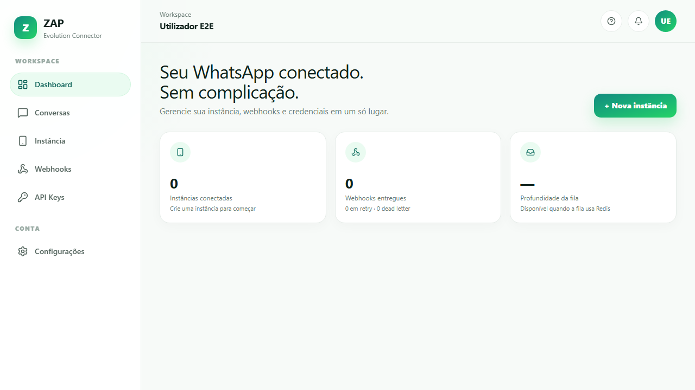
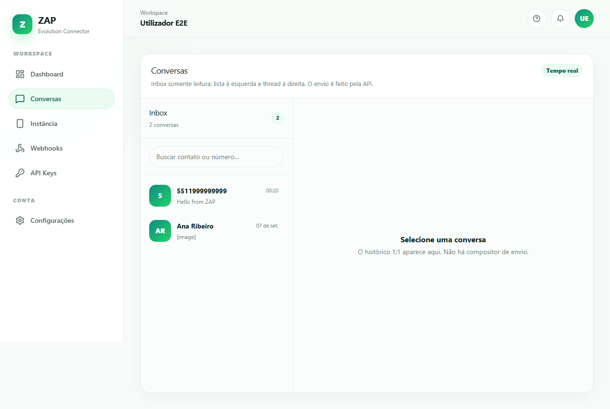
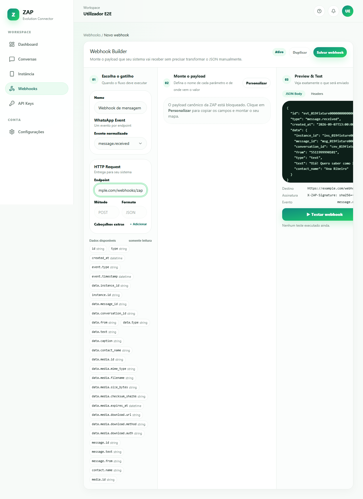
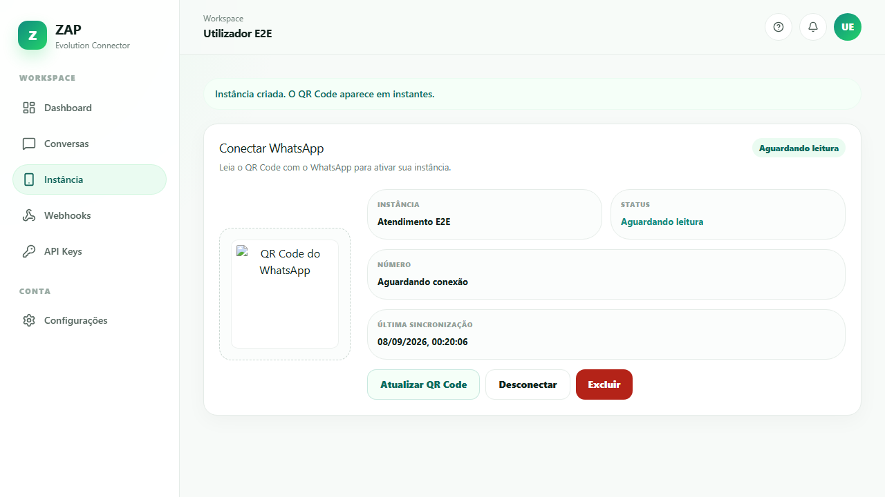
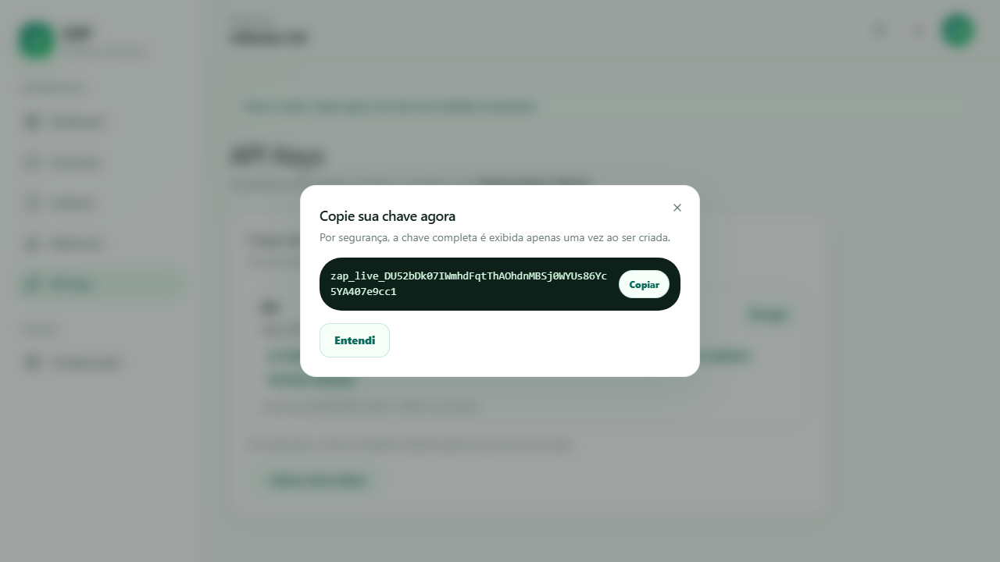
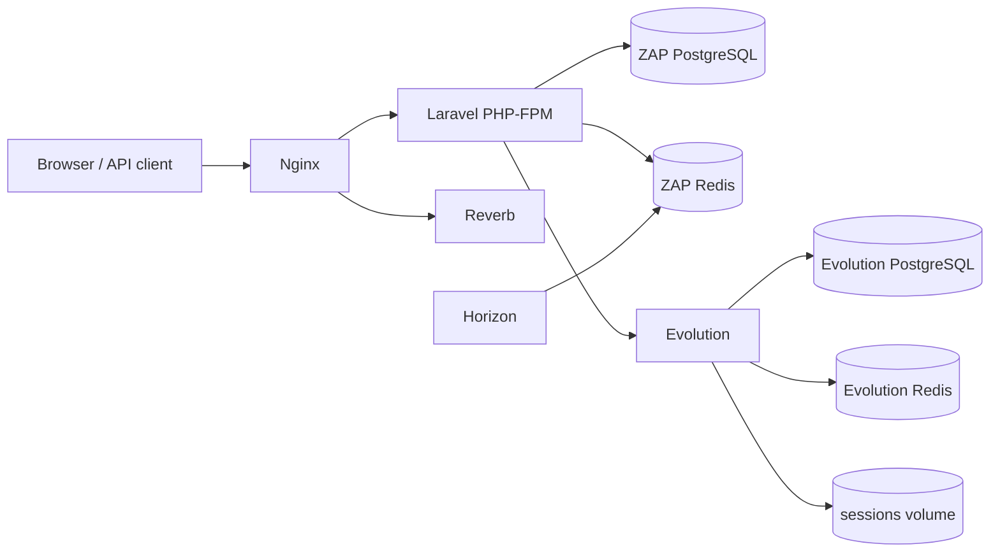

# ZAP

ZAP is a plug-and-play, self-hosted **integrator** on top of Evolution API. After `docker compose up`, a platform admin allowlists emails, a user registers, a WhatsApp instance is created, a QR Code is scanned, an API key is generated, and the simplified ZAP API plus signed webhooks can be consumed.

ZAP is an integrator, not a CRM, chatbot builder, workflow engine, or official WhatsApp product.

ZAP is an independent open-source project and is not affiliated with,
endorsed by, or sponsored by WhatsApp or Meta.

## Screenshots











## Architecture



ZAP owns inbox rows, media metadata, API keys, and customer webhooks. Evolution is a pipe: instance persistence stays on; message/contact/history persistence stays off.

## Features

- Platform admin email allowlist and gated registration
- One workspace per user on signup
- Async WhatsApp instance provisioning, QR, connect, disconnect, delete
- Sanctum API keys with abilities; plaintext shown once
- `POST /api/v1/messages/text` returns `202 Accepted`
- Read-only 1:1 inbox (text + type placeholders)
- Inbound media on a Docker volume and authenticated download
- Customer webhooks: canonical JSON, allowlisted mapper, HMAC signatures, SSRF controls, retries
- Horizon queues and dashboard counters from real data (no fake availability %)

## Stack

| Layer | Choice |
|---|---|
| PHP | 8.5 |
| Backend | Laravel 13 |
| Frontend | Vue 3 + TypeScript + Inertia 3 |
| CSS | Tailwind CSS 4 + shadcn-vue |
| Database | PostgreSQL 18 |
| Cache / queues | Redis 8 + Horizon |
| Realtime | Laravel Reverb + polling fallback |
| Tests | Pest, Vitest, Playwright |
| API docs | Scramble (OpenAPI 3.1) + Scalar |
| License | Apache-2.0 |

## Docker local setup

Docker Compose is the **only** supported way to run ZAP.

```bash
cp .env.example .env
```

Set `ADMIN_EMAIL` and `ADMIN_PASSWORD` before the first boot. In non-local environments the process refuses to start if `ADMIN_PASSWORD` is empty or a well-known default.

```bash
docker compose up --build
```

Open [http://localhost:8000](http://localhost:8000). Sign in as the seeded platform admin, allowlist an email, then register that email to receive a workspace.

Forgotten passwords are not supported: a platform admin deletes the user and the allowlisted email may register again.

There is no host PHP/Node install path. Pin image versions; do not use `:latest`.

## Evolution notes

- Evolution is bundled in Compose with its own Postgres, Redis, and session volume.
- ZAP talks to it on the Docker network at `http://evolution:8080`.
- It is published only on loopback as `127.0.0.1:8080` in development.
- Evolution Manager is **not** included.
- Message, contact, and historic persistence inside Evolution is turned off. Instance persistence stays on.
- Do not expose Evolution on a public interface.
- Do not add `VITE_EVOLUTION_*` variables.

## Testing

Default Pest does **not** start Evolution. HTTP fakes and fixtures live under `tests/Fixtures/Evolution/`.

```bash
composer lint
composer analyse
composer test
composer audit
npm run lint
npm run typecheck
npm run test
npm run build
npm audit --audit-level=high
composer docs
```

Playwright covers the critical path with Evolution mocked (`MESSAGING_DRIVER=fake`):

```bash
npx playwright install --with-deps chromium
npm run test:e2e
```

## API documentation

Scalar renders the generated OpenAPI 3.1 contract at [`/docs/api`](http://localhost:8000/docs/api) (local, or any authenticated user). This is an API reference, not a guides portal.

Examples:

- [cURL](docs/examples/send-text.curl.md)
- [JavaScript / TypeScript](docs/examples/send-text.ts.md)
- [PHP](docs/examples/send-text.php.md)
- [Media download](docs/examples/download-media.curl.md)

CI runs `php artisan scramble:analyze` and `php artisan scramble:export`. Generation errors fail the build.

## Configuration

Copy `.env.example`. Important keys (placeholders only in the example file):

| Variable | Role |
|---|---|
| `ADMIN_EMAIL` / `ADMIN_PASSWORD` | Seeded platform admin |
| `MAX_INSTANCES_PER_WORKSPACE` | Quota (default `1`) |
| `EVOLUTION_BASE_URL` / `EVOLUTION_API_KEY` | Server-side provider access |
| `EVOLUTION_WEBHOOK_BASE_URL` | How Evolution reaches ZAP (`http://nginx` in Compose) |
| `SANCTUM_TOKEN_PREFIX` | Display prefix (`zap_live_`) |
| `RETENTION_*` | Inbox, media, webhook payload, idempotency TTLs |
| `WEBHOOK_ALLOW_HTTP` | Local Compose may allow `http://` sinks |

See [`docs/SDD.md`](docs/SDD.md) for the full contract.

## Security

- Session cookies for the first-party UI; hashed Sanctum tokens for `/api/v1`
- Provider tokens, webhook secrets, and extra headers encrypted at rest
- Customer webhook SSRF controls on Test and live delivery
- Mapping is allowlisted; no JavaScript expressions
- Never log Authorization headers, API keys, tokens, webhook secrets, passwords, full QR payloads, full message bodies, or media bytes

Report vulnerabilities privately. See [SECURITY.md](SECURITY.md).

## Roadmap

`v0.1.0` is the first-release scope in [`docs/SDD.md`](docs/SDD.md) §50. Later ideas (billing, outbound email, production deploy, Evolution Manager, in-app docs portal) live in §51 and are **not** in this revision.

## Contributing

See [CONTRIBUTING.md](CONTRIBUTING.md), [CODE_OF_CONDUCT.md](CODE_OF_CONDUCT.md), and [docs/adr](docs/adr).

## License

Apache License 2.0. See [LICENSE](LICENSE) and [NOTICE](NOTICE).

## Trademark disclaimer

ZAP is an independent open-source project and is not affiliated with,
endorsed by, or sponsored by WhatsApp or Meta.

Evolution API is an external dependency and keeps its own license and trademark terms.
