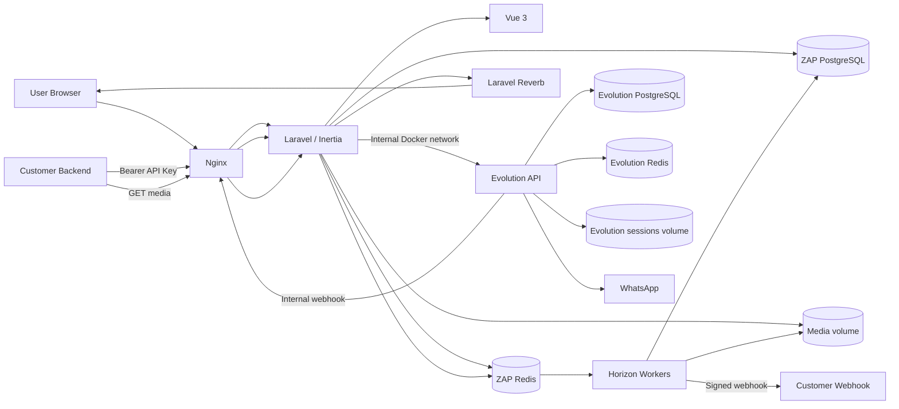
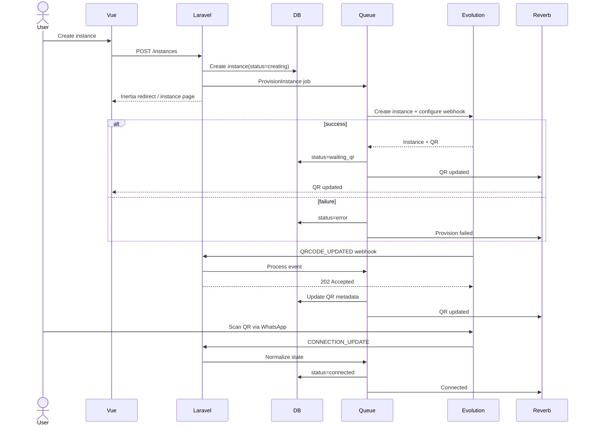
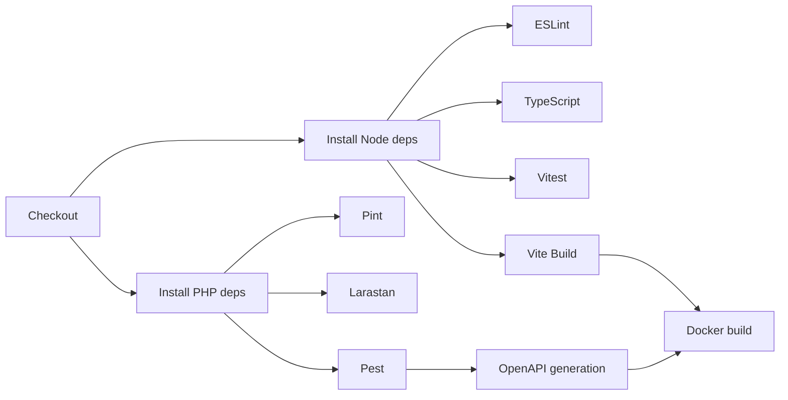
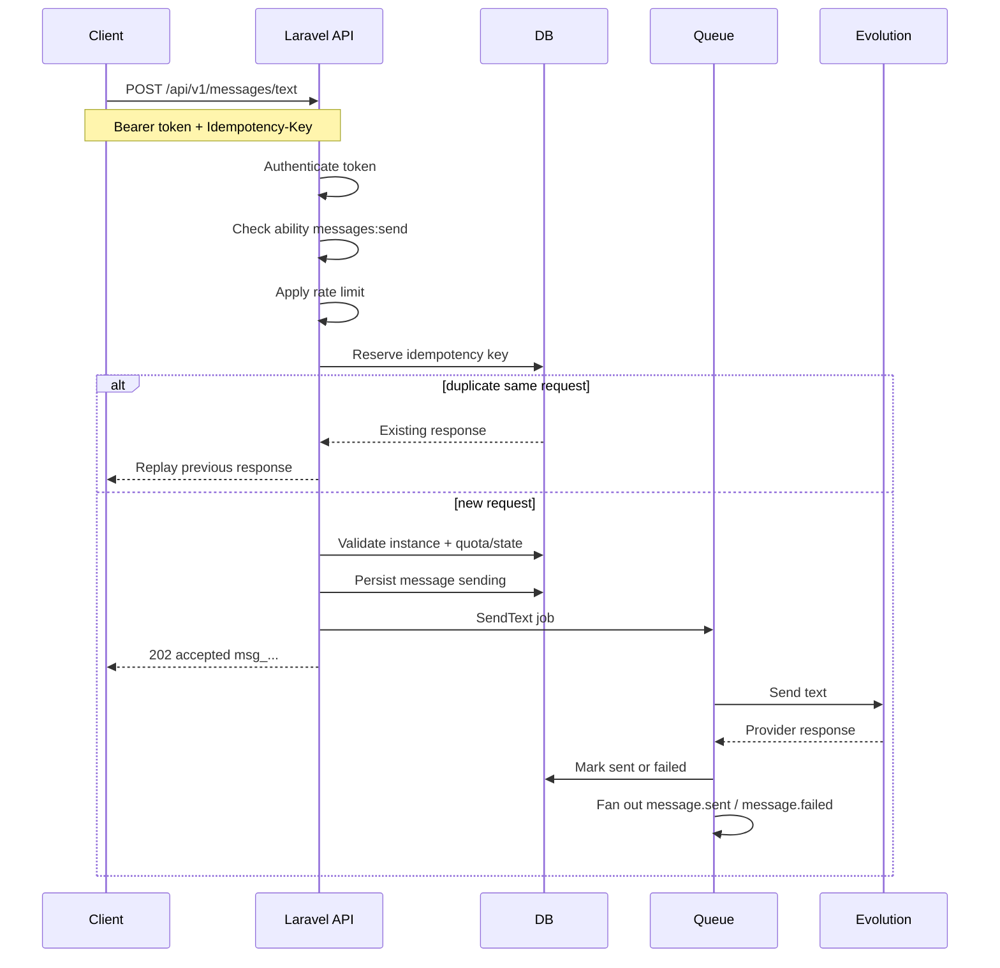
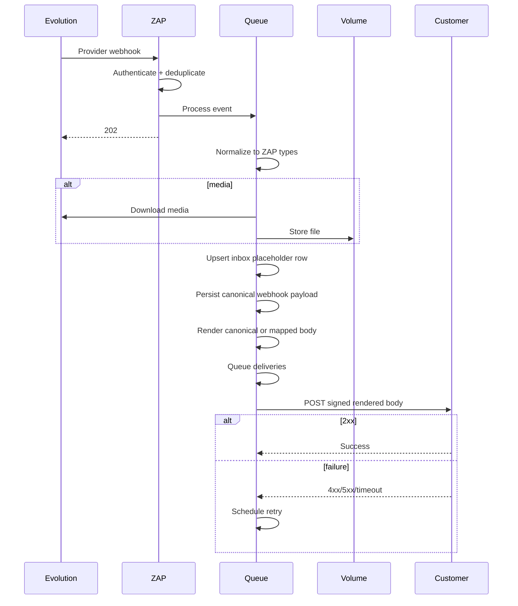

# ZAP — Software Design Document (SDD)

> **Status:** Draft v1.2 (webhook builder)  
> **Project type:** Open-source self-hosted micro SaaS / portfolio project  
> **Primary stack:** Laravel + Vue + Inertia.js  
> **Primary integration:** Evolution API (bundled in Docker)  
> **License:** Apache-2.0  
> **Document language:** English  
> **Code identifiers, comments, commit messages, pull requests, and technical documentation:** English  
> **Product UI:** Portuguese (pt-BR), prepared for future i18n  
> **Out of scope in this revision:** production deployment, billing implementation, outbound email

---

## 1. Purpose

ZAP is a plug-and-play, self-hosted layer on top of Evolution API.

The product removes infrastructure and integration complexity from developers who need to connect WhatsApp to their applications. After `docker compose up`, a platform admin allowlists emails, a user registers, a WhatsApp instance is created, a QR Code is scanned, an API key is generated, and the simplified ZAP API plus signed webhooks can be consumed.

ZAP is an **integrator**, not a CRM. It also exposes a **read-only inbox** so operators can inspect traffic that passed through the platform.

The open-source repository must demonstrate professional software engineering practices, including:

- modern Laravel architecture;
- Vue 3 + TypeScript frontend architecture;
- Inertia.js modern-monolith patterns;
- secure third-party API integration;
- webhook ingestion and delivery;
- asynchronous processing;
- API authentication and authorization;
- multi-tenancy (single workspace per user in MVP);
- idempotency;
- observability;
- automated tests;
- static analysis;
- CI quality gates (no production deploy);
- Docker-based local environment including Evolution API;
- generated API documentation;
- secure secret handling;
- maintainable Git practices.

---

## 2. Product Vision

### 2.1 Problem

Evolution API is powerful, but a developer still needs to understand instance provisioning, authentication, QR Code handling, webhook configuration, event formats, retries, security, and infrastructure.

ZAP provides an opinionated abstraction layer with a simpler developer experience. The public contract is ZAP-owned. Evolution remains an internal implementation detail.

### 2.2 Value Proposition

A developer should be able to go from a cloned repository to a connected WhatsApp instance in a few minutes:

1. Run `docker compose up`.
2. Sign in as the seeded platform admin.
3. Allowlist an email.
4. Register that user.
5. Create an instance (async).
6. Scan the QR Code.
7. Generate an API key.
8. Configure a customer webhook (canonical JSON or mapped payload).
9. Send and receive events using the ZAP API.
10. Inspect traffic in the read-only inbox.

### 2.3 Product Principles

- **Simple outside, robust inside.**
- **Secure by default.**
- **Provider details must not leak into the public API unless necessary.**
- **Async work must be observable and retryable.**
- **No Evolution API credentials in the browser.**
- **No hidden magic where explicit domain behavior is clearer.**
- **Prefer a modular monolith before introducing microservices.**
- **Keep the project easy to run locally with Docker only.**
- **Use stable production-ready releases, not prerelease software.**
- **Persist only what the product needs; Evolution is a pipe, not a message store.**
- **Do not ship production deployment in this SDD revision.**

---

## 3. Goals

### 3.1 MVP Goals

The MVP must support:

- Docker Compose stack: ZAP + Evolution API + isolated persistence;
- seeded platform admin from environment variables;
- email whitelist managed by the platform admin;
- user registration gated by the whitelist;
- one workspace created automatically on signup;
- Evolution API configuration via server-side environment only;
- WhatsApp instance creation (async);
- QR Code display and refresh (realtime + polling fallback);
- connection status synchronization;
- instance disconnect/delete;
- API key creation and revocation;
- API key abilities/scopes;
- simplified public REST API;
- async text message sending (`202 Accepted`);
- customer webhook endpoint creation;
- webhook builder (default ZAP payload, optional mapping, preview, test);
- one event type per webhook endpoint;
- webhook signing;
- webhook delivery retries;
- webhook delivery logs;
- Evolution webhook ingestion;
- ZAP-normalized customer webhooks, including media metadata;
- short-lived media files on a Docker volume and authenticated download;
- read-only 1:1 inbox (text + type placeholders);
- README + Markdown docs + generated OpenAPI/Scalar;
- dashboard metrics;
- audit log for sensitive operations;
- GitHub Actions quality gates.

### 3.2 Portfolio Goals

The repository should visibly demonstrate:

- clean boundaries around third-party integrations;
- SOLID principles without unnecessary abstraction;
- framework-native Laravel practices;
- TypeScript-first Vue code;
- domain-oriented organization;
- reliable queues;
- idempotent webhook processing;
- idempotent public API operations;
- security thinking;
- automated quality gates;
- reproducible Docker environments;
- clear documentation.

---

## 4. Non-Goals for This SDD Revision

The following are intentionally out of scope:

- production deployment (VPS playbooks, Kubernetes, Helm, TLS termination guides);
- billing implementation (Stripe/Paddle);
- outbound email of any kind (verification, password reset, invites, Mailpit);
- password recovery;
- workspace teams, invitations, and extra workspace roles in the UI;
- multiple workspaces per user;
- Evolution Manager / Evolution frontend;
- publishing Evolution on a public interface;
- persisting message history inside Evolution;
- rendering media in the inbox (images, audio, stickers, documents);
- WhatsApp groups;
- sending non-text messages via the public API;
- full CRM;
- chatbot builder;
- n8n-style workflow engine (graphs, IF nodes, delays, JavaScript expressions);
- multiple event types on a single customer webhook;
- marketing automation;
- bulk message campaigns;
- AI agents;
- in-app documentation portal (`/docs/getting-started`, etc.);
- 2FA;
- Kubernetes;
- event sourcing;
- Kafka;
- microservices;
- custom OAuth authorization server;
- indefinite raw WhatsApp history.

These can be added later only when justified by product requirements.

Future billing must reuse the same registration/entitlement gate: “may this email/user use the product?” MVP implementation is the whitelist.

---

## 5. Architecture Style

ZAP will be implemented as a **modular modern monolith**.

Laravel owns:

- routing;
- session authentication;
- authorization;
- domain orchestration;
- validation;
- persistence;
- queues;
- public API;
- webhook ingestion;
- webhook delivery;
- media ingest/download;
- third-party integration.

Vue owns:

- interactive UI;
- forms;
- dashboard state;
- read-only inbox presentation;
- reusable components;
- local presentation state.

Inertia.js connects Laravel and Vue without requiring a separate internal REST API for the first-party web application.

The public developer API is a separate Laravel route surface under `/api/v1`.

### 5.1 Why a Modular Monolith

The project does not need microservices at MVP scale.

A modular monolith provides:

- one deployable application;
- one main codebase;
- simple local development;
- straightforward transactions;
- lower operational complexity;
- strong domain boundaries;
- an easy future path to extracting services if real scaling requirements appear.

---

## 6. High-Level Architecture



ZAP and Evolution must not share database schemas, Redis instances, or session storage.

---

## 7. Technology Baseline

The initial repository should target the following production-ready baseline.

| Layer | Technology | Decision |
|---|---|---|
| Backend runtime | PHP 8.5 | Current stable PHP branch with active support |
| Backend framework | Laravel 13.x | Primary application framework |
| Frontend | Vue 3 | Composition API + `<script setup>` |
| Frontend language | TypeScript | Mandatory for application code |
| App bridge | Inertia.js 3.x | Modern monolith |
| Bundler | Vite 8.x | Development and production asset build |
| CSS | Tailwind CSS 4.x | Utility-first design system |
| UI primitives | shadcn-vue | Accessible, customizable primitives |
| Database | PostgreSQL 18.x | ZAP primary relational database |
| Cache / queues | Redis 8.x | ZAP cache, rate limits, queues |
| Queue dashboard | Laravel Horizon | Queue supervision and metrics |
| Realtime | Laravel Reverb | Connection/QR/inbox updates |
| Web server | Nginx | Reverse proxy / static assets |
| Containers | Docker + Compose v2 | The only supported local runtime |
| Node runtime | Node.js 24 LTS | Frontend tooling |
| PHP testing | Pest | Latest stable compatible with Laravel 13 |
| Browser testing | Playwright | Critical end-to-end flows |
| Frontend unit tests | Vitest | Component/composable tests |
| PHP formatting | Laravel Pint | PSR-aligned formatting |
| PHP static analysis | Larastan / PHPStan | Strict static analysis |
| JS linting | ESLint | TypeScript/Vue quality |
| Formatting | Prettier | Frontend formatting |
| API docs | Scramble + Scalar | OpenAPI 3.1 + reference UI |
| CI | GitHub Actions | Quality and build checks only |

### 7.1 Version Policy

Do not use `latest` tags in Compose or Dockerfiles.

Images must use:

- explicit major/minor versions;
- preferably image digests;
- lock files committed to Git;
- automated dependency update pull requests.

Prerelease versions are not allowed in the main branch unless explicitly documented in an ADR.

Pin the Evolution API image to a specific version. Do not follow `evoapicloud/evolution-api:latest`.

---

## 8. Repository Layout

Recommended structure:

```text
zap/
├── app/
│   ├── Domain/
│   │   ├── Accounts/
│   │   ├── ApiKeys/
│   │   ├── Conversations/
│   │   ├── Instances/
│   │   ├── Media/
│   │   ├── Messaging/
│   │   ├── Platform/
│   │   └── Webhooks/
│   ├── Integrations/
│   │   └── Evolution/
│   ├── Http/
│   │   ├── Controllers/
│   │   ├── Middleware/
│   │   ├── Requests/
│   │   └── Resources/
│   ├── Jobs/
│   ├── Models/
│   ├── Policies/
│   ├── Providers/
│   └── Support/
├── bootstrap/
├── config/
├── database/
│   ├── factories/
│   ├── migrations/
│   └── seeders/
├── docker/
│   ├── nginx/
│   ├── php/
│   ├── evolution/
│   └── scripts/
├── docs/
│   ├── adr/
│   ├── architecture/
│   └── SDD.md
├── public/
├── resources/
│   ├── css/
│   └── js/
│       ├── Components/
│       ├── Composables/
│       ├── Layouts/
│       ├── Pages/
│       ├── Types/
│       └── app.ts
├── routes/
│   ├── api.php
│   ├── console.php
│   ├── platform.php
│   ├── web.php
│   └── webhooks.php
├── storage/
│   └── app/
│       └── media/
├── tests/
│   ├── Feature/
│   ├── Integration/
│   ├── Unit/
│   └── Browser/
├── .github/
│   ├── ISSUE_TEMPLATE/
│   ├── pull_request_template.md
│   └── workflows/
├── compose.yaml
├── Dockerfile
├── composer.json
├── package.json
├── phpstan.neon
├── pint.json
├── vite.config.ts
├── CONTRIBUTING.md
├── SECURITY.md
├── CODE_OF_CONDUCT.md
├── LICENSE
├── CHANGELOG.md
└── README.md
```

### 8.1 Domain Organization Rule

Do not force every class into a theoretical DDD pattern.

Use domain folders to group business behavior, while continuing to use Laravel conventions where they provide value.

Good examples:

```text
app/Domain/Instances/Actions/CreateInstance.php
app/Domain/Instances/Actions/DisconnectInstance.php
app/Domain/Messaging/Actions/AcceptOutboundText.php
app/Domain/Media/Actions/StoreInboundMedia.php
app/Domain/Platform/Actions/AllowlistEmail.php
app/Domain/Webhooks/Actions/DeliverWebhook.php
app/Domain/Webhooks/Actions/RenderWebhookPayload.php
app/Domain/Webhooks/Actions/TestWebhookEndpoint.php
```

External provider code must remain outside domain logic:

```text
app/Integrations/Evolution/EvolutionMessagingProvider.php
app/Integrations/Evolution/EvolutionClient.php
app/Integrations/Evolution/EvolutionMediaDownloader.php
app/Integrations/Evolution/Data/EvolutionQrCode.php
app/Integrations/Evolution/Exceptions/EvolutionApiException.php
```

Eloquent models remain under `app/Models` unless a later ADR justifies colocation.

### 8.2 Avoid Unnecessary Repository Pattern

Eloquent is already an ORM and persistence abstraction.

Do not create generic repositories such as `UserRepository` unless a real persistence boundary or multiple storage implementations are required.

Prefer:

- Eloquent models;
- query objects for complex reusable queries;
- actions for business use cases;
- interfaces at the Evolution boundary (`MessagingProvider`).

---

## 9. Core Domain Model

### 9.1 User

Represents an authenticated person.

Core fields:

- `id`
- `public_id` (`usr_...`)
- `name`
- `email`
- `password`
- `is_platform_admin`
- `disabled_at`
- `created_at`
- `updated_at`

There is no `email_verified_at` in MVP. ZAP sends no email.

### 9.2 Platform admin vs workspace roles

Authorization has two independent axes.

**Platform axis** (seeded from `.env`):

- manage email whitelist;
- list users;
- disable or delete users;
- later: billing, global quotas.

**Workspace axis** (MVP):

- every registered user receives exactly one workspace;
- that user is `owner`;
- no team UI, invites, or extra roles in MVP.

Do not collapse platform admin into `workspaces.role = admin`.

The seeded admin may also own a workspace if their email is allowlisted and they use the product, but platform permissions stay separate.

### 9.3 EmailAllowlist

Platform-managed registration gate.

Fields:

- `id`
- `email` (unique, normalized)
- `created_by_user_id`
- timestamps

Registration succeeds only when the email is present, the user is not disabled, and the account does not already exist.

This gate is the extension point for future subscriptions.

### 9.4 Workspace

Tenant boundary.

Fields:

- `id`
- `public_id` (`ws_...`)
- `name`
- `slug`
- `owner_user_id`
- `max_instances` (nullable override; otherwise env default)
- timestamps

MVP constraint: one workspace per user, created during registration. No “create workspace” UI.

### 9.5 WorkspaceMember

Membership exists so team features can be added later without a schema rewrite.

MVP: a single `owner` row per workspace.

Roles reserved for later:

- `owner`
- `admin`
- `developer`
- `viewer`

### 9.6 Instance

Represents a ZAP-managed Evolution API instance.

Fields:

- `id`
- `public_id` (`ins_...`)
- `workspace_id`
- `name`
- `provider` (`evolution`)
- `provider_instance_name`
- `provider_instance_token_encrypted`
- `status`
- `phone_number`
- `connected_at`
- `last_seen_at`
- timestamps
- soft delete timestamp

Suggested statuses:

```text
creating
waiting_qr
connecting
connected
disconnected
error
deleting
```

Do not use raw Evolution status strings throughout the application.

Map provider states into a ZAP-owned enum.

Default quota: `MAX_INSTANCES_PER_WORKSPACE=1`.

### 9.7 ApiToken

Use Laravel Sanctum personal access tokens.

Required capabilities include:

```text
instances:read
instances:write
messages:send
messages:read
media:read
webhooks:read
webhooks:write
```

Tokens must be shown in plaintext only at creation time.

### 9.8 Conversation and Contact

Inbox projection owned by ZAP.

`Contact`:

- `id`
- `public_id` (`ctc_...`)
- `workspace_id`
- `instance_id`
- `wa_id` (E.164 / provider peer id)
- `display_name` (if known)
- timestamps

`Conversation`:

- `id`
- `public_id` (`cnv_...`)
- `workspace_id`
- `instance_id`
- `contact_id`
- `last_message_at`
- timestamps

MVP: direct chats only. No groups.

### 9.9 Message

Inbox row. Not a CRM document store.

Fields:

- `id`
- `public_id` (`msg_...`)
- `workspace_id`
- `instance_id`
- `conversation_id`
- `direction` (`inbound` | `outbound`)
- `type` (`text`, `image`, `audio`, `video`, `sticker`, `document`, `location`, `contacts`, `unknown`)
- `status` (`accepted`, `sending`, `sent`, `failed`, `received`)
- `body` (actual text, or a placeholder such as `[image]`)
- `media_id` (nullable)
- `occurred_at`
- timestamps

Non-text inbox presentation uses placeholders only. The UI does not render media.

### 9.10 MediaObject

Short-lived file stored by ZAP after inbound ingest (and for outbound later, if needed).

Fields:

- `id`
- `public_id` (`med_...`)
- `workspace_id`
- `instance_id`
- `message_id`
- `type`
- `mime_type`
- `filename`
- `size_bytes`
- `checksum`
- `disk_path`
- `expires_at`
- timestamps

Files live on a Docker volume, not MinIO/S3 in MVP.

Never serve the volume publicly. Download only through the authenticated API.

### 9.11 WebhookEndpoint

Customer destination plus delivery mapping.

MVP rule: **one endpoint = one event type = one map**. Duplicate the endpoint to listen to another event.

Fields:

- `id`
- `public_id` (`wh_...`)
- `workspace_id`
- `name`
- `url`
- `description`
- `event_type` (single ZAP event name)
- `payload_mode` (`canonical` | `custom`)
- `body_mapping` (JSON; empty when canonical)
- `headers_mapping_encrypted` (JSON; optional extra headers)
- `secret_encrypted`
- `enabled`
- `failure_count`
- timestamps

Example event names:

```text
instance.qr.updated
instance.connected
instance.disconnected
message.received
message.updated
message.sent
message.failed
```

Public ZAP event names must not mirror Evolution event names one-to-one unless intentionally part of the public contract.

There is no many-to-many subscription table in MVP. `event_type` on the endpoint is the subscription.

`payload_mode=canonical` sends the documented ZAP envelope. `custom` applies the builder map. **Restore default** sets `canonical` and clears `body_mapping`.

### 9.12 WebhookEvent

Normalized event persisted for delivery and retry.

Fields:

- `id`
- `public_id` (`evt_...`)
- `workspace_id`
- `instance_id`
- `type`
- `provider_event_type`
- `provider_event_id`
- `payload` (ZAP-normalized JSON, including media metadata)
- `payload_hash`
- `occurred_at`
- `received_at`
- `expires_at`

Default retention: 7 days.

### 9.13 WebhookDelivery

A delivery attempt to a customer endpoint.

Fields:

- `id`
- `public_id` (`dlv_...`)
- `webhook_event_id`
- `webhook_endpoint_id`
- `attempt`
- `status`
- `http_status`
- `response_excerpt`
- `duration_ms`
- `next_retry_at`
- `delivered_at`
- timestamps

### 9.14 ApiRequest / IdempotencyRecord

Stores idempotent mutation requests.

Fields:

- `workspace_id`
- `api_token_id`
- `idempotency_key`
- `request_hash`
- `response_status`
- `response_body`
- `expires_at`

### 9.15 Public ID format

Internal primary key: `bigint`.

Public identifier: prefix + UUIDv7.

Examples:

```text
usr_019...
ws_019...
ins_019...
msg_019...
evt_019...
med_019...
cnv_019...
wh_019...
```

Never expose sequential primary keys in the public API or Inertia URLs.

---

## 10. Multi-Tenancy

ZAP uses shared-database, shared-schema multi-tenancy.

Every tenant-owned record must include `workspace_id`.

### Rules

- Every tenant resource is scoped to the current workspace.
- Authorization must be enforced with Laravel Policies.
- Route model binding must not bypass workspace ownership checks.
- Unique constraints should include `workspace_id` where relevant.
- Queue jobs must carry explicit workspace/resource IDs.
- Never trust a workspace ID supplied by the browser without authorization.
- Platform admin user listing is not a cross-workspace data leak of conversations or messages.
- Cross-workspace reads must have automated tests.

Do not introduce database-per-tenant architecture for MVP.

---

## 11. Authentication and Authorization

### 11.1 First-Party Web Application

Use Laravel session authentication.

Do not authenticate the Inertia application with public API tokens.

MVP features:

- registration (whitelist gated);
- login;
- logout;
- secure session cookies;
- CSRF protection.

Explicitly absent in MVP:

- email verification;
- password reset;
- outbound mail;
- 2FA.

Forgotten password: unsupported. Operational escape hatch: platform admin deletes the user; the allowlisted email may register again.

### 11.2 Seeded platform admin

Required environment variables:

```dotenv
ADMIN_EMAIL=
ADMIN_PASSWORD=
```

A seeder/bootstrap step creates or updates this user with `is_platform_admin=true`.

`.env.example` must contain placeholders only. Refuse to boot in non-local environments if `ADMIN_PASSWORD` is empty or matches a well-known default.

### 11.3 Public API

Use Laravel Sanctum personal access tokens.

Header:

```http
Authorization: Bearer <token>
```

Use token abilities for authorization.

### 11.4 Roles

Platform permissions, workspace permissions, and token abilities are separate concerns and must not be merged.

---

## 12. Evolution API Integration Boundary

All Evolution API communication must go through an explicit integration layer.

MVP includes the `MessagingProvider` interface on day one, with a single implementation: `EvolutionMessagingProvider`.

The interface must speak **ZAP types only**. Evolution URLs, event names, and payloads must not leak through the interface.

### 12.1 Interface

```php
interface MessagingProvider
{
    public function createInstance(CreateProviderInstanceData $data): ProviderInstance;
    public function connectInstance(string $instanceName): QrCodeData;
    public function getConnectionState(string $instanceName): ProviderConnectionState;
    public function sendText(SendTextData $data): ProviderMessage;
    public function downloadMedia(DownloadMediaData $data): ProviderMedia;
    public function configureWebhook(ConfigureProviderWebhookData $data): void;
    public function deleteInstance(string $instanceName): void;
}
```

Initial implementation:

```text
EvolutionMessagingProvider
```

This boundary allows future support for another Evolution deployment or WhatsApp Cloud API without changing the public ZAP contract.

### 12.2 HTTP Client

Use Laravel's HTTP client.

Required behavior:

- explicit connect timeout;
- explicit request timeout;
- limited retries only for safe operations;
- retry with jitter where appropriate;
- structured exception mapping;
- request correlation ID;
- sanitized logs;
- no secrets in logs.

### 12.3 Credential Handling

The Evolution API global key must be configured server-side through environment/secrets management.

It must never be:

- sent to Vue;
- stored in browser storage;
- returned by an Inertia prop;
- exposed in public API responses;
- written to application logs.

Instance-level provider tokens must be encrypted at rest when persistence is required.

### 12.4 Provider Instance Names

Do not expose user-provided names directly to Evolution.

Generate an internal provider-safe identifier such as:

```text
zap_<workspace-public-id>_<instance-public-id>
```

### 12.5 Evolution as a pipe

Evolution must persist **instance/session data only**.

Disable Evolution application-level history where the image allows, including message, contact, chat, label, and historic saves.

WhatsApp session files remain on the Evolution volume (`/evolution/instances`). That volume is mandatory so QR scans survive container restarts.

ZAP is the system of record for conversations, messages, media files, and customer webhooks.

### 12.6 Network

Evolution listens on the Docker network only.

Development Compose may publish `127.0.0.1:8080:8080` for debugging.

Do not publish Evolution in a production-like compose overlay.

Do not include Evolution Manager.

ZAP calls Evolution at `EVOLUTION_BASE_URL` (example: `http://evolution:8080`).

Evolution calls ZAP at `EVOLUTION_WEBHOOK_BASE_URL` (example: `http://nginx`), never `localhost` of the developer machine.

---

## 13. Instance Creation Flow

Instance provisioning is asynchronous.



The HTTP request must not wait on Evolution.

The UI must poll connection/QR state as a fallback if Reverb is unavailable.

---

## 14. Internal Evolution Webhook

Evolution sends events to a ZAP-owned endpoint.

Example:

```text
POST /internal/webhooks/evolution/{instancePublicId}
```

### 14.1 Authentication

When configuring the Evolution webhook, ZAP should attach a generated custom secret header, for example:

```text
X-ZAP-Evolution-Secret: <random-secret>
```

The secret must:

- be generated using a cryptographically secure random generator;
- contain at least 256 bits of entropy;
- be encrypted at rest;
- support rotation.

The inbound controller validates it using constant-time comparison.

### 14.2 Ingestion Rule

The controller must do minimal synchronous work:

1. authenticate request;
2. validate maximum payload size;
3. identify instance;
4. calculate idempotency fingerprint;
5. persist or enqueue raw event reference;
6. dispatch processing job;
7. return quickly.

Business processing must happen asynchronously.

Target response:

```http
202 Accepted
```

### 14.3 Idempotency

Webhooks can be duplicated.

Processing must therefore be idempotent.

Preferred key order:

1. provider event/message ID when stable;
2. provider message ID + event type;
3. deterministic hash of canonicalized payload + instance + event type.

A duplicate event must not generate duplicate customer deliveries or duplicate inbox rows.

---

## 15. Event Normalization

Evolution event names are provider-specific.

Create a normalization layer that maps into ZAP events and ZAP message types.

Examples:

| Evolution Event | ZAP Event |
|---|---|
| `QRCODE_UPDATED` | `instance.qr.updated` |
| `CONNECTION_UPDATE` | `instance.connection.updated` |
| `MESSAGES_UPSERT` | `message.received` or `message.updated` |
| `MESSAGES_UPDATE` | `message.updated` |
| `SEND_MESSAGE` | `message.sent` |

Never let provider-specific payloads define the long-term public contract accidentally.

Store the original provider payload only according to webhook retention rules, for debugging fields that are not part of the public contract.

---

## 16. Inbox and Media

### 16.1 Inbox rules

- Source of truth: ZAP database, fed by inbound webhooks and outbound API accepts.
- Direct chats only.
- UI is read-only.
- Text messages show `body`.
- Other types show placeholders (`[image]`, `[audio]`, `[sticker]`, `[document]`, …).
- Outbound text appears in the thread with status `sending` → `sent` / `failed`.
- Realtime updates via Reverb, with polling fallback.

### 16.2 Media ingest

On inbound media:

1. Normalize the event to a ZAP media object (type, mime, filename, size, checksum when available).
2. Download the bytes through `MessagingProvider::downloadMedia`.
3. Store the file on the media volume.
4. Persist a slim `Message` row (`type` + placeholder + `media_id`).
5. Persist a rich `WebhookEvent` payload that includes `media_id` and download metadata.
6. Fan out signed customer webhooks.

Do not put Evolution URLs or Evolution credentials in customer webhooks or in the browser.

### 16.3 Customer media download

```http
GET /api/v1/media/{media}
Authorization: Bearer <token>
```

Authorize with `media:read` and workspace ownership.

After `expires_at`, the object is deleted and the API returns a stable error such as `media_expired`. The inbox row remains until message retention expires and may display an expired-media state.

### 16.4 Retention defaults

All three clocks are configurable via environment variables.

| Data | Default |
|---|---|
| Inbox messages / conversations | 90 days |
| Media files | 7 days |
| Webhook event payloads | 7 days |
| Failed delivery response excerpt | 7 days |
| QR code data | Until connection or short expiration |
| API request idempotency records | 24 hours |
| Audit logs | 90 days |

A scheduled job enforces retention.

---

## 17. Customer Webhooks

Customers configure webhook endpoints in ZAP.

ZAP receives Evolution events, normalizes them to a **canonical ZAP event**, persists that payload for retry, then delivers to matching endpoints (`event_type` + workspace).

Delivery body is either the canonical envelope or a **projection** built by the Webhook Builder. HMAC is always computed over the **bytes actually POSTed**.

This is a payload mapper, not a workflow engine. No graphs, conditions, delays, or JavaScript.

### 17.1 Webhook Builder

The first-party UI matches the product mockup: trigger → map → preview → test → save.

Layout:

1. **Trigger** — event type (one), destination URL.
2. **Map** — locked in canonical mode; editable rows after **Personalizar**.
3. **Preview** — live JSON body and headers on the right.

New endpoints start in `payload_mode=canonical`. The preview shows the official ZAP JSON for that event. Mapping rows are disabled until the user clicks **Personalizar**, which copies canonical leaves into rows. **Restaurar padrão** returns to canonical and discards the custom map.

Save does **not** require a successful live test. Local validation does: URL, SSRF rules, HTTPS (non-local), known event type, mapping parse, allowlisted variable paths, header allowlist.

**Testar** sends a signed request with a **catalog fixture** for that event type (fake ids, fake text, fake media metadata). It includes `X-ZAP-Test: true`. The UI shows status, latency, and an excerpt of the response. `2xx` / timeout / `4xx`/`5xx` are diagnostic only. The same SSRF rules apply as production delivery.

Duplicate creates a new endpoint with the same map and a new secret.

### 17.2 Mapping model

Each body row:

```text
path:        dotted output key (customer.name → nested object)
value_mode:  field | fixed | expression
value:       event path, literal, or template
```

`field` copies a value from the canonical event using an allowlisted path (`message.text`, `data.from`, `media.id`, …). The catalog is per event type.

`fixed` is a literal string.

`expression` is a mustache-like template with allowlisted substitutions only, for example `zap-{{ message.id }}`. No JavaScript, no filters, no loops, no function calls. Unknown paths fail **local** validation and never reach delivery.

Custom header rows use the same three modes. Header **values** are encrypted at rest.

### 17.3 Missing values

- **Canonical mode:** documented shape. Text events omit the `media` object; image events include it.
- **Custom mode:** every mapped key is present. Missing runtime values become `null`. Delivery does not fail because a field is absent.

### 17.4 Canonical delivery payload

The public default contract is ZAP-normalized. It must contain everything the integrating customer needs to obtain media through ZAP, without depending on Evolution’s JSON shape.

Example, text:

```json
{
  "id": "evt_019...",
  "type": "message.received",
  "created_at": "2026-09-07T13:00:00Z",
  "data": {
    "instance_id": "ins_019...",
    "message_id": "msg_019...",
    "conversation_id": "cnv_019...",
    "from": "5511999999999",
    "type": "text",
    "text": "Hello"
  }
}
```

Example, image:

```json
{
  "id": "evt_019...",
  "type": "message.received",
  "created_at": "2026-09-07T13:00:00Z",
  "data": {
    "instance_id": "ins_019...",
    "message_id": "msg_019...",
    "conversation_id": "cnv_019...",
    "from": "5511999999999",
    "type": "image",
    "caption": "optional",
    "media": {
      "id": "med_019...",
      "mime_type": "image/jpeg",
      "filename": "photo.jpg",
      "size_bytes": 204800,
      "checksum_sha256": "...",
      "expires_at": "2026-09-14T13:00:00Z",
      "download": {
        "url": "/api/v1/media/med_019...",
        "method": "GET",
        "auth": "bearer"
      }
    }
  }
}
```

README and Scalar document this default. Custom maps are per-endpoint and are not the global API contract.

### 17.5 Transport and headers

Delivery is always:

```http
POST
Content-Type: application/json
User-Agent: ZAP-Webhooks/1.0
X-ZAP-Event-Id: evt_...
X-ZAP-Timestamp: 1788786000
X-ZAP-Signature: sha256=<hex-hmac>
```

Test deliveries also send:

```http
X-ZAP-Test: true
```

The user may add extra headers from this allowlist:

- `Authorization`
- `Accept`
- `X-*` except `X-ZAP-*`

Forbidden (always owned by ZAP or HTTP):

- `Host`
- `Content-Length`
- `Transfer-Encoding`
- `Content-Type`
- `User-Agent`
- any `X-ZAP-*`

ZAP appends signature headers after user headers. User mapping cannot override them.

No GET, PUT, form, or XML in MVP.

### 17.6 Signature

Recommended signing input:

```text
{timestamp}.{raw_request_body}
```

Algorithm:

```text
HMAC-SHA256
```

Customer secret must be at least 256 bits.

The signed body is the rendered body (canonical or mapped), not the pre-map canonical copy, unless they are the same.

### 17.7 Retry Policy

Suggested retry schedule:

```text
attempt 1: immediate
attempt 2: 30 seconds
attempt 3: 2 minutes
attempt 4: 10 minutes
attempt 5: 1 hour
attempt 6: 6 hours
attempt 7: 24 hours
```

Add randomized jitter to avoid retry storms.

After final failure: `dead_letter`.

The dashboard must allow manual retry while the webhook payload still exists.

Test button requests are not retried by Horizon.

### 17.8 Successful Delivery

Treat only HTTP `2xx` as success.

Redirects should not be followed automatically unless explicitly supported and secured.

### 17.9 SSRF Protection

Customer webhook URLs are an SSRF surface. **Test** and **live** delivery share the same rules.

Rules:

- require HTTPS in non-local environments;
- local Compose may allow `http://` to host-gateway test sinks;
- reject localhost;
- reject loopback networks;
- reject private RFC1918 ranges in non-local environments;
- reject link-local ranges;
- reject cloud metadata addresses;
- reject reserved IP ranges;
- resolve DNS before connection;
- validate the resolved IP;
- protect against DNS rebinding;
- disable redirects;
- limit response body size;
- enforce short connect/read timeouts.

This requirement is mandatory.


---

## 18. Public API Design

Base path:

```text
/api/v1
```

API responses are JSON only.

The public API is a server-to-server API. Do not enable permissive browser CORS.

### 18.1 Versioning

Use URL versioning. Breaking changes require a new major API version.

### 18.2 Resources

Initial endpoints:

```text
GET    /api/v1/instances
POST   /api/v1/instances
GET    /api/v1/instances/{instance}
DELETE /api/v1/instances/{instance}

GET    /api/v1/instances/{instance}/connection
POST   /api/v1/instances/{instance}/qr/refresh

POST   /api/v1/messages/text

GET    /api/v1/conversations
GET    /api/v1/conversations/{conversation}
GET    /api/v1/conversations/{conversation}/messages

GET    /api/v1/media/{media}

GET    /api/v1/webhook-endpoints
POST   /api/v1/webhook-endpoints
PATCH  /api/v1/webhook-endpoints/{endpoint}
DELETE /api/v1/webhook-endpoints/{endpoint}
POST   /api/v1/webhook-endpoints/{endpoint}/test
POST   /api/v1/webhook-endpoints/{endpoint}/duplicate

GET    /api/v1/webhook-deliveries
POST   /api/v1/webhook-deliveries/{delivery}/retry
```

### 18.3 Response Envelope

Success:

```json
{
  "data": {}
}
```

Collection:

```json
{
  "data": [],
  "meta": {
    "current_page": 1,
    "per_page": 20
  },
  "links": {}
}
```

Error:

```json
{
  "error": {
    "code": "instance_not_connected",
    "message": "The instance is not connected.",
    "request_id": "req_..."
  }
}
```

Do not expose stack traces or provider error payloads.

### 18.4 Idempotency

Mutation endpoints that may cause external side effects should accept:

```http
Idempotency-Key: <client-generated-value>
```

The same key + same payload returns the stored result.

The same key + different payload returns `409 Conflict`.

Required for:

- message send;
- instance creation.

### 18.5 Rate Limiting

Rate limit by API token, workspace, and endpoint category.

Return standard rate-limit headers where practical.

### 18.6 Text send flow

`POST /api/v1/messages/text` is asynchronous.

1. Authenticate token and `messages:send`.
2. Apply rate limit.
3. Reserve idempotency key.
4. Validate instance ownership and `connected` state.
5. Persist outbound `Message` with status `accepted`/`sending`.
6. Return `202 Accepted` with `msg_...`.
7. A job calls `MessagingProvider::sendText`.
8. On success, mark `sent` and emit `message.sent`.
9. On failure, mark `failed` and emit `message.failed`.

---

## 19. API Key Design

API keys are user-managed credentials.

Use Sanctum as the underlying token mechanism.

Recommended UI fields:

- name;
- abilities;
- created at;
- last used at;
- optional expiration;
- revoke action.

Example display prefix:

```text
zap_live_...
```

If a custom human-readable prefix is implemented, it must not weaken Sanctum's secure token verification.

The full token must be displayed only once.

Never persist plaintext token values.

---

## 20. Frontend Architecture

### 20.1 Vue Rules

Use Vue 3, TypeScript, Composition API, `<script setup lang="ts">`, typed props, typed emits, and composables for reusable stateful behavior.

Avoid global mutable state by default, Vuex, large page components, and business logic inside UI components.

### 20.2 State Management

Do not add Pinia by default.

Use Inertia props, component state, composables, and Reverb/Echo.

### 20.3 Pages

Example:

```text
Pages/
├── Auth/Login.vue
├── Auth/Register.vue
├── Dashboard/Index.vue
├── Instances/Index.vue
├── Instances/Create.vue
├── Instances/Show.vue
├── Inbox/Index.vue
├── Inbox/Show.vue
├── ApiKeys/Index.vue
├── Webhooks/Index.vue
├── Webhooks/Builder.vue
├── Webhooks/Show.vue
└── Platform/
    ├── Allowlist/Index.vue
    └── Users/Index.vue
```

### 20.4 Design System

Use Tailwind CSS theme variables as design tokens.

The product may use a green/white visual language inspired by messaging products, but must avoid implying official WhatsApp affiliation.

### 20.5 Accessibility

Minimum target: semantic HTML, keyboard navigation, visible focus states, WCAG AA contrast, labels for all inputs, ARIA only when semantic HTML is insufficient, reduced-motion support, accessible dialogs and dropdowns.

UI copy is Portuguese (pt-BR). Code remains English.

---

## 21. Documentation Architecture

MVP documentation has two layers. There is **no** in-app guides portal.

### 21.1 Repository docs

- `README.md` — overview, screenshots, Docker quick start, security notes, license/disclaimer;
- `docs/` — additional Markdown guides as needed;
- `docs/adr/` — architecture decision records;
- `docs/SDD.md` — this document.

### 21.2 API Reference

Generate OpenAPI 3.1 from the Laravel API using Scramble.

Render the API reference with Scalar.

The generated contract must be part of CI. A CI check should fail when API documentation generation fails.

### 21.3 Documentation Examples

Examples must exist for cURL, JavaScript/TypeScript, and PHP.

All code comments in examples must be English.

---

## 22. Realtime Updates

Use Laravel Reverb for dashboard realtime behavior.

Initial events:

```text
InstanceQrUpdated
InstanceConnectionChanged
InstanceProvisionFailed
MessageAccepted
MessageSent
MessageFailed
MessageReceived
WebhookDeliveryCompleted
WebhookDeliveryFailed
```

Broadcast only to private workspace/user channels.

Example:

```text
private-workspaces.{workspacePublicId}
```

Authorization must verify membership.

Do not broadcast provider credentials, media bytes, or complete private webhook payloads.

---

## 23. Queue Architecture

Redis-backed queues managed by Horizon.

Suggested queues:

```text
critical
webhooks
provider
media
default
maintenance
```

Examples:

### `critical`

- connection status processing;
- security-related events.

### `webhooks`

- customer webhook deliveries;
- retries.

### `provider`

- instance provisioning;
- outbound text send;
- non-blocking Evolution API jobs.

### `media`

- inbound media download and storage.

### `maintenance`

- retention cleanup;
- stale-instance reconciliation;
- metrics aggregation.

### 23.1 Job Requirements

Every job must define timeout, retry count, backoff, idempotency behavior, tags, and failure behavior when appropriate.

Jobs must be safe to retry.

Do not serialize complete Eloquent object graphs into queues.

Prefer IDs and reload state inside the job.

---

## 24. Reconciliation

Webhooks are not sufficient as the only source of truth for connection state.

Create a scheduled reconciliation process:

```text
every 5 minutes:
  inspect recently active instances
  compare ZAP state with Evolution connection state
  repair stale status if necessary
```

This protects against lost webhook events, temporary queue failures, Evolution restarts, and network partitions.

Inbox history is not reconciled from Evolution, because Evolution is not the message store.

---

## 25. Database Guidelines

Use PostgreSQL for ZAP.

Evolution uses its own PostgreSQL instance.

### 25.1 IDs

- internal `bigint` primary key;
- public prefixed UUIDv7.

### 25.2 Constraints

Prefer database-enforced invariants: foreign keys, unique indexes, check constraints, non-null constraints, partial indexes for real query patterns.

Examples:

```text
unique(workspace_id, owner) via one-workspace-per-user unique(owner_user_id)
unique(allowlist.email)
unique(workspace_id, instance.name) among non-deleted rows
```

### 25.3 JSON

Use `jsonb` only for data that is genuinely semi-structured, such as webhook payloads.

Do not store relational domain data as JSON merely for convenience.

---

## 26. Security Requirements

Security is a core product requirement.

### 26.1 Secrets

Secrets include:

- Evolution global API key;
- Evolution instance token;
- internal Evolution webhook secret;
- customer webhook signing secret;
- application key;
- platform admin password;
- database passwords;
- Redis passwords if configured.

Rules:

- never commit secrets;
- use `.env.example` with placeholders;
- encrypt persisted reversible secrets;
- redact secret fields from logs.

### 26.2 API Tokens

- hashed at rest;
- abilities/scopes;
- revocable;
- optionally expiring;
- plaintext shown once;
- last-used timestamp;
- audit event on create/revoke.

### 26.3 Web Security

Required:

- CSRF protection;
- secure cookies;
- `HttpOnly`;
- `SameSite=Lax` or stricter where compatible;
- `X-Content-Type-Options: nosniff`;
- frame protection;
- referrer policy.

HTTPS/HSTS/CSP production hardening is deferred with production deployment.

### 26.4 Sensitive Data

Phone numbers and message content are personal data.

Default strategy:

- store only data needed by product features;
- configurable retention;
- redact message bodies in normal logs;
- delete related data when a workspace or user is deleted, subject to operational/audit requirements.

### 26.5 Logs

Never log:

- Authorization headers;
- Evolution API keys;
- API tokens;
- webhook secrets;
- custom webhook header values;
- passwords;
- entire QR Code payloads;
- entire message bodies by default;
- media bytes.

### 26.6 QR Codes

QR codes represent temporary authentication material.

Rules:

- never place QR values in application logs;
- do not cache publicly;
- serve only to authorized workspace members;
- expire local QR data quickly;
- remove it after successful connection.

### 26.7 Media volume

- not mounted as a static web root;
- paths are internal;
- downloads require a valid API token and workspace scope;
- filenames on disk must not be guessable (use `public_id`).

### 26.8 Webhook mapping

- do not evaluate JavaScript or arbitrary expressions;
- allowlisted event paths only;
- encrypt custom header values at rest;
- never let user headers override `X-ZAP-*`, `Host`, `Content-Type`, `User-Agent`, or hop-by-hop headers;
- apply SSRF controls to both Test and live delivery.

---

## 27. Error Handling

Define domain exceptions and provider exceptions separately.

Examples:

```text
RegistrationEmailNotAllowlisted
InstanceQuotaExceeded
InstanceNotConnected
InstanceAlreadyConnected
WebhookEndpointUnavailable
WebhookMappingInvalid
WebhookHeaderNotAllowed
MediaExpired
ProviderAuthenticationFailed
ProviderRateLimited
ProviderUnavailable
```

Map internal exceptions into stable public error codes.

The public API must not expose raw Evolution API errors.

Attach a request/correlation ID to errors.

---

## 28. Observability

### 28.1 Structured Logging

Use JSON logs.

Every request should include `request_id`, `workspace_id`, `user_id`, `api_token_id`, `instance_id`, `job_id`, `webhook_event_id` when relevant.

### 28.2 Metrics

Track:

- request latency;
- API error rate;
- provider latency;
- provider failures;
- active instances;
- connected/disconnected instances;
- webhook queue depth;
- webhook success rate;
- webhook retry count;
- dead-letter deliveries;
- media ingest failures;
- expired media download attempts;
- queue wait time;
- job failure rate.

### 28.3 Laravel Tooling

Use Horizon for queues.

Pulse may be used locally.

Telescope only in local/development.

Production APM is out of scope for this SDD revision.

---

## 29. Testing Strategy

Testing should prioritize behavior over implementation details.

### 29.1 Backend

Use Pest.

#### Unit

Event normalization, signature generation, retry calculation, public ID formatting, placeholders, webhook mapping/templates, header allowlist, value objects, enums.

#### Feature

Authentication, whitelist gating, platform admin user deletion, workspace authorization, Inertia pages, API routes, token abilities, validation, rate limiting, instance quota.

#### Integration

Evolution client using Laravel HTTP fakes, webhook ingestion, media ingest with fake downloader, webhook delivery, queue workflows, database constraints.

Do not require a live Evolution container for the default test suite.

### 29.2 Frontend

Use Vitest for composables, formatting utilities, and complex reusable components.

Do not unit-test trivial presentational markup.

### 29.3 End-to-End

Use Playwright for critical flows, with Evolution mocked:

1. platform admin allowlists an email;
2. user registers and lands in a workspace;
3. creates instance;
4. simulated Evolution event marks instance connected;
5. creates API key;
6. sends text via API (202);
7. inbound fixture creates an inbox row and media object;
8. customer webhook delivery is visible;
9. builder preview matches fixture; test does not block save;
10. media download succeeds with the API key.

### 29.4 Contract Tests

Fixtures based on real sanitized Evolution payload shapes should be committed under:

```text
tests/Fixtures/Evolution/
```

---

## 30. Static Analysis and Code Quality

### PHP

```bash
composer lint
composer analyse
composer test
```

```text
lint    -> Pint --test
analyse -> Larastan/PHPStan
test    -> Pest
```

Target high PHPStan/Larastan strictness.

New code must not add ignored static-analysis errors without justification.

### TypeScript

```bash
npm run lint
npm run typecheck
npm run test
npm run build
```

TypeScript must use strict mode.

Avoid `any`. When `any` is unavoidable at a third-party boundary, isolate and validate it immediately.

---

## 31. Coding Standards

### 31.1 Language

The following must be English: class names, method names, variable names, database names, route names, source-code comments, commit messages, branch names, pull request titles/descriptions, issue templates, technical documentation.

The product UI may be Portuguese.

### 31.2 Comments

Comments should explain **why**, not restate **what** the code does.

### 31.3 PHP

Prefer typed properties, return types, enums, readonly DTOs where appropriate, constructor property promotion, named arguments when they improve readability, small controllers, Form Requests, Policies, and Actions.

Avoid service locator patterns, static helper classes for domain behavior, large controllers, arbitrary "Manager" classes, generic base repositories, and hidden model observers for critical business workflows.

---

## 32. Git Strategy

Use trunk-based development with short-lived feature branches.

```text
feat/instance-provisioning
feat/webhook-signatures
fix/duplicate-webhook-events
refactor/evolution-client
docs/api-authentication
```

Do not use long-running `develop` branches.

`main` must always be runnable via Docker Compose.

---

## 33. Commit Convention

Use Conventional Commits. All commit messages must be English.

Examples:

```text
feat(instances): queue provider provisioning
feat(api): accept text messages with 202
feat(inbox): add read-only direct chat
feat(media): store inbound files for authenticated download
feat(platform): gate registration with email allowlist
fix(webhooks): prevent duplicate event fan-out
docs(sdd): document dockerized evolution topology
chore(ci): add static analysis workflow
```

Rules: imperative mood, concise subject, no period at the end of the subject, meaningful scope when useful, explain the reason in the body for non-trivial changes.

---

## 34. Pull Request Standard

Every PR should include:

```markdown
## What changed

## Why

## How to test

## Screenshots

## Security impact

## Breaking changes
```

PRs must be small enough to review.

Do not mix unrelated refactors with feature behavior unless necessary.

---

## 35. CI Pipeline

GitHub Actions runs on every pull request.

This SDD does **not** include production deploy workflows.



Required checks:

- Composer validation;
- Pint;
- Larastan/PHPStan;
- Pest with PostgreSQL and Redis service containers;
- ESLint;
- TypeScript typecheck;
- Vitest;
- frontend production build;
- OpenAPI generation;
- dependency vulnerability audit;
- Docker image build.

Do **not** start Evolution API in PR CI.

Run Playwright on `main` (and PRs that touch critical flows) with Evolution mocked.

---

## 36. Dependency Security

Enable Dependabot or Renovate, GitHub dependency review, CodeQL, Composer audit, and npm audit or equivalent.

Do not automatically merge major-version upgrades.

Security updates may be auto-merged only after CI passes and repository policy allows it.

---

## 37. Docker Architecture

Docker Compose is the only supported way to run ZAP locally.

### 37.1 Compose services

```text
nginx
app
vite
postgres          # ZAP
redis             # ZAP
horizon
scheduler
reverb
evolution
evolution-postgres
evolution-redis
```

Not in MVP Compose:

```text
mailpit
evolution-manager
minio
```

### 37.2 Container Responsibilities

#### `nginx`

- published entrypoint (example `8080`);
- static asset serving;
- FastCGI proxy to PHP-FPM;
- Reverb websocket proxy;
- security headers;
- upload/request size limits;
- Evolution webhook path reachable as `http://nginx/internal/webhooks/evolution/...`.

#### `app`

- PHP-FPM;
- Laravel application;
- entrypoint: wait for Postgres/Redis, `key:generate` if needed, `migrate --force`, seed platform admin.

#### `vite`

- Node.js 24 LTS;
- Vite development server;
- HMR.

#### `horizon` / `scheduler` / `reverb`

Same application image, different commands.

#### `evolution`

- pinned image;
- depends on `evolution-postgres` and `evolution-redis`;
- volume `evolution_instances`;
- env: instance persistence on, message/contact/historic persistence off;
- published only as `127.0.0.1:8080:8080` in development.

#### `evolution-postgres` / `evolution-redis`

Dedicated to Evolution. No shared schemas or Redis databases with ZAP.

### 37.3 Application image

Use multi-stage builds (`node-builder`, `composer-builder`, `php-runtime`).

Node.js must not be required in the final PHP runtime container.

Run application processes as a non-root user.

Use health checks.

Production-like overlays (TLS, replicas, secret managers) are out of scope for this SDD revision.

---

## 38. Environment Configuration

`.env.example` must contain only placeholders.

Example categories:

```text
APP_*
ADMIN_*
DB_*
REDIS_*
REVERB_*
EVOLUTION_*
WEBHOOK_*
MEDIA_*
RETENTION_*
QUOTA_*
RATE_LIMIT_*
LOG_*
```

Suggested values:

```dotenv
APP_URL=http://localhost:8080

ADMIN_EMAIL=
ADMIN_PASSWORD=

EVOLUTION_BASE_URL=http://evolution:8080
EVOLUTION_API_KEY=
EVOLUTION_WEBHOOK_BASE_URL=http://nginx
EVOLUTION_CONNECT_TIMEOUT=3
EVOLUTION_REQUEST_TIMEOUT=10

MAX_INSTANCES_PER_WORKSPACE=1

RETENTION_INBOX_DAYS=90
RETENTION_MEDIA_DAYS=7
RETENTION_WEBHOOK_PAYLOAD_DAYS=7
```

Never expose Evolution variables with a `VITE_` prefix.

---

## 39. Health Checks

Expose `GET /up` for application health.

Compose health should distinguish:

- app process alive;
- ZAP database reachable;
- ZAP Redis reachable;
- Evolution process alive (Evolution’s own health, not mixed into `/up`).

Do not make ZAP `/up` fail solely because Evolution is temporarily unavailable.

---

## 40. Audit Log

Audit sensitive actions:

- allowlist email added/removed;
- user disabled/deleted;
- API key created/revoked;
- instance created/deleted/disconnected;
- webhook endpoint created;
- webhook secret rotated;
- webhook mapping changed;
- quota override changed.

Audit log entries should include actor, workspace (when applicable), action, target type/id, request id, IP, user agent, timestamp, metadata.

Never store secret values in audit metadata.

---

## 41. Documentation and Open-Source Files

The repository must include:

```text
README.md
LICENSE          # Apache-2.0
CHANGELOG.md
CONTRIBUTING.md
SECURITY.md
CODE_OF_CONDUCT.md
.editorconfig
.gitattributes
.dockerignore
docs/SDD.md
docs/adr/
```

### README Sections

1. project overview;
2. screenshots;
3. architecture diagram;
4. features;
5. technology stack;
6. Docker local setup (the only setup);
7. Evolution notes (bundled, internal, no Manager);
8. testing;
9. API documentation (Scalar);
10. security;
11. roadmap;
12. contributing;
13. license;
14. trademark/disclaimer.

---

## 42. Architecture Decision Records

Initial ADRs:

```text
0001-use-modular-monolith.md
0002-use-inertia-modern-monolith.md
0003-use-messaging-provider-interface.md
0004-use-postgresql.md
0005-use-redis-horizon.md
0006-use-sanctum-api-tokens.md
0007-sign-customer-webhooks.md
0008-use-shared-schema-multitenancy.md
0009-bundle-evolution-in-compose.md
0010-isolate-evolution-persistence.md
0011-async-provider-operations.md
0012-zap-owned-inbox-and-media.md
0013-allowlist-registration-gate.md
0014-apache-2.0-license.md
0015-ci-without-deploy.md
0016-webhook-payload-mapper.md
```

ADR format:

```markdown
# ADR-0001: Title

## Status

Accepted

## Context

## Decision

## Consequences
```

---

## 43. Licensing and Trademark Notes

ZAP uses **Apache License 2.0**.

The repository must not imply that ZAP is an official WhatsApp product.

Required disclaimer:

```text
ZAP is an independent open-source project and is not affiliated with,
endorsed by, or sponsored by WhatsApp or Meta.
```

Evolution API is an external dependency/integration and keeps its own license and trademark terms.

Do not copy Evolution API source code into the ZAP repository unless its license requirements are intentionally reviewed and followed.

Prefer API-level integration.

---

## 44. API Documentation Example

Example request:

```bash
curl --request POST \
  --url http://localhost:8080/api/v1/messages/text \
  --header "Authorization: Bearer YOUR_ZAP_API_KEY" \
  --header "Content-Type: application/json" \
  --header "Idempotency-Key: 3f5b8269-72d4-4d48-a0d1-d892992c66db" \
  --data '{
    "instance_id": "ins_019...",
    "to": "5511999999999",
    "text": "Hello from ZAP"
  }'
```

Example response:

```json
{
  "data": {
    "id": "msg_019...",
    "status": "accepted",
    "instance_id": "ins_019..."
  }
}
```

HTTP status: `202 Accepted`.

---

## 45. API Request Flow



---

## 46. Webhook Delivery Flow



---

## 47. Performance Guidelines

Optimize after measuring.

Initial practices:

- eager-load relationships intentionally;
- prevent accidental N+1 queries in development/tests;
- paginate all user-facing large collections;
- index actual query paths;
- queue fan-out work and media downloads;
- keep Evolution HTTP timeouts strict;
- avoid storing oversized provider payloads indefinitely.

Do not introduce Octane solely because it is faster.

---

## 48. Definition of Done

A feature is done when:

- behavior is implemented;
- authorization is enforced;
- validation exists;
- tests cover primary behavior and failure cases;
- static analysis passes;
- formatting passes;
- frontend types pass;
- API docs are updated/generated when relevant;
- logs contain useful context without secrets;
- security implications were considered;
- user-facing errors are understandable;
- repository documentation is updated when relevant;
- CI is green.

---

## 49. Initial Milestones

### Milestone 0 — Foundation

- Laravel 13 project;
- Vue + TypeScript + Inertia 3 starter;
- Tailwind 4;
- Docker Compose with ZAP services;
- Nginx, PostgreSQL, Redis, Horizon, Reverb;
- pinned Evolution + isolated Postgres/Redis/volume;
- CI quality gates;
- Pint, Larastan, Pest, ESLint, TypeScript strict mode;
- Apache-2.0, README skeleton, `.env.example`.

### Milestone 1 — Accounts and Platform Gate

- seeded platform admin;
- whitelist UI;
- gated registration;
- automatic workspace + owner membership;
- policies;
- user disable/delete;
- audit log foundation;
- quota env default.

### Milestone 2 — Evolution Integration

- `MessagingProvider` + Evolution implementation;
- async instance create;
- QR fetch/realtime;
- status;
- delete/disconnect;
- HTTP fake tests.

### Milestone 3 — Provider Webhooks

- secure internal endpoint;
- custom secret header;
- deduplication;
- queue processing;
- event normalization;
- realtime instance status.

### Milestone 4 — Public API Keys

- Sanctum;
- token creation UI;
- abilities;
- revoke;
- last used;
- public API middleware;
- rate limiting.

### Milestone 5 — Messaging API and Inbox

- async text send;
- idempotency;
- inbox 1:1 read-only;
- placeholders for non-text types;
- media volume ingest + download API;
- customer webhook fan-out with ZAP media object;
- retention job.

### Milestone 6 — Customer Webhooks

- endpoints (one event type each);
- canonical default payload;
- builder: personalize / restore, preview, fixture test;
- allowlisted templates and extra headers;
- HMAC on rendered body;
- SSRF on test and live;
- retries;
- delivery history;
- duplicate;
- manual retry.

### Milestone 7 — Documentation and OSS Polish

- README;
- screenshots;
- Markdown docs;
- OpenAPI + Scalar;
- CONTRIBUTING, SECURITY, CODE_OF_CONDUCT;
- ADRs;
- GitHub issue templates;
- PR template;
- dependency automation;
- CHANGELOG.

Production deployment and billing are later milestones, not part of this SDD.

---

## 50. Recommended First Release Scope

Tag:

```text
v0.1.0
```

Must include:

- Docker-based local setup including Evolution;
- platform admin + whitelist;
- registration;
- one workspace;
- async instance provisioning;
- QR connection;
- connection status;
- API key generation;
- async text send API;
- read-only inbox;
- media download for customers;
- customer webhooks with builder, signatures and retries;
- README + Scalar;
- automated tests;
- CI quality gates.

Billing must not block `v0.1.0`.

No fake pricing page. Quotas come from environment variables.

---

## 51. Future Enhancements

Potential later work:

- Stripe or Paddle billing replacing/extending the whitelist gate;
- outbound email and password reset;
- workspace invitations and roles;
- additional workspaces per user;
- media rendering in the inbox;
- MinIO/S3 media backend;
- groups;
- non-text send API;
- official WhatsApp Cloud API provider;
- production deployment guides;
- OpenTelemetry;
- team usage-based quotas;
- API SDKs;
- CLI;
- 2FA;
- in-app documentation portal;
- n8n-style multi-node workflows;
- JavaScript expressions in webhook maps;
- multiple event types on one customer endpoint.

---

## 52. Engineering Principle Summary

The project should demonstrate maturity by resisting unnecessary complexity.

Use modern tools where they solve a concrete problem:

- Docker Compose as the only local runtime, including Evolution;
- Inertia instead of an unnecessary internal SPA API;
- queues for unreliable external work;
- a ZAP-typed `MessagingProvider` around Evolution;
- typed DTOs at boundaries;
- database constraints for invariants;
- policies for tenancy and platform admin;
- Sanctum for scoped developer tokens;
- Redis/Horizon for retries and visibility;
- Reverb for realtime UX with polling fallback;
- a webhook mapper on top of a stable canonical event, not a workflow engine;
- OpenAPI for a stable public contract;
- CI for automated quality enforcement, not deploy.

The strongest portfolio signal is not the number of technologies used.

It is a codebase where every technology has a clear reason to exist.
